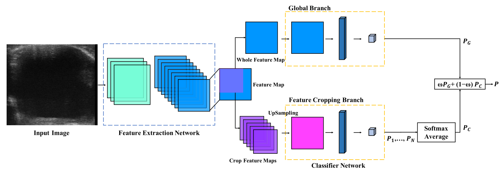

# Thyroid-Nodule-Ultrasound-Image-Classification

Implementation detail for our paper ["Thyroid Nodule Ultrasound Image Classification Through Hybrid Feature Cropping Network"](https://ieeexplore.ieee.org/abstract/document/9044854).



## Abstract

With the increasing cases of thyroid malignant tumors, the diagnosis of thyroid nodule has attracted more and more attention. Deep learning has achieved promising results in computer-aided diagnosis due to the advantages of obtaining high-dimensional features. In this paper, we proposed a hybrid multi-branch convolutional neural network based on feature cropping method for feature extraction and classification of thyroid nodule ultrasound images. Firstly, we designed a backbone convolutional neural network to extract shared feature maps and a classification network as global branch. Next, we added a feature cropping branch in the network to perform multi-cropping on batch feature maps, to reduce the impact on classification caused by the similarity of local features between benign and malignant thyroid nodule images. Finally, based on softmax predictions of different branch feature maps, we utilize a weighted cross-entropy loss function to train our proposed binary-classification network. Experimental results show that our proposed method has achieved 96.13% accuracy, 93.24% precision, 97.18% recall, and 95.17% F1-measure in public dataset and local dataset, outperforming other models.

## Dataset

You can download the dataset from [HERE]() (coming soon!)

## Envs

- Pytorch 1.0
- Python 3+
- cuda 9.0+

## Training

```
Coming soon!
```


## Testing

```
Coming soon!
```


## Citation

Please cite this paper in your publications if it helps your research:

```
@article{song2020thyroid,
  title={Thyroid nodule ultrasound image classification through hybrid feature cropping network},
  author={Song, Ruoning and Zhang, Long and Zhu, Chuang and Liu, Jun and Yang, Jie and Zhang, Tong},
  journal={IEEE Access},
  volume={8},
  pages={64064--64074},
  year={2020},
  publisher={IEEE}
}
```

## Contact

 If you have questions, please contact us: czhu@bupt.edu.cn
